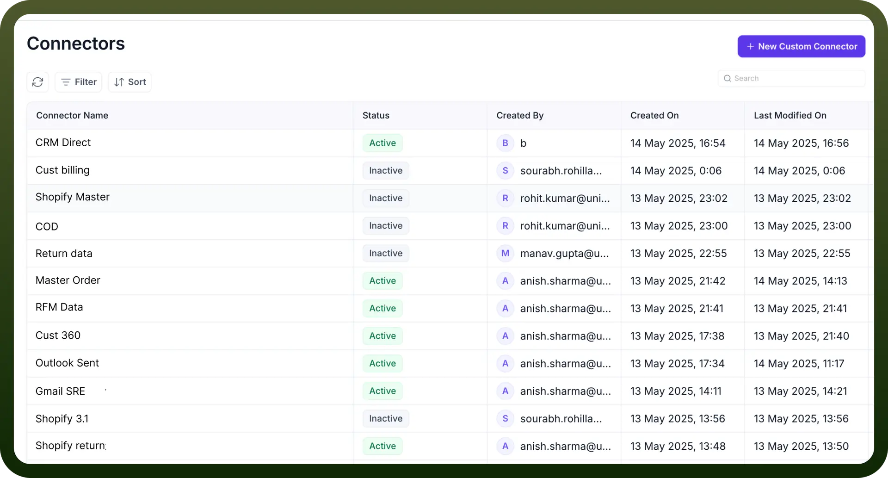

# Connector SDK

Source: https://www.unifyapps.com/docs/platform-tools/connector-sdk
Section: platform-tools

---

## Overview

**Connector SDK** is a module within **UnifyApps** that allows users to connect custom connectors within UnifyApps platform. Through this, customers can connect to any custom end point and start having a bi-directional connection (both receive & send data), through which they can take actions on external apps as well.

## Why Connector SDK?

In today's complex digital ecosystem, businesses often need to connect with proprietary systems, legacy applications, or emerging technologies that don't have pre-built connectors. The Connector SDK eliminates these integration barriers by providing a framework to develop custom connector solutions that work seamlessly within the UnifyApps environment.

## Key Features

1. **Custom Connector Management:** Easily view and manage all your custom connectors in one centralized dashboard. The Connector SDK interface displays essential details like:
  - Connector Name
  - Status (Active/Inactive)
  - Created By
  - Created On
  - Last Modified On
2. **Status Monitoring**: Each connector shows a status such as "Active" or "Inactive," allowing you to quickly identify which custom integrations are operational and which may require attention.
3. **Version Control:** Track when connectors were created and last modified, helping maintain proper documentation and governance, especially in collaborative development environments.
4. **Simplified Creation Process:** With the New Custom Connector button, users can initiate the development of new connectors through a guided, step-by-step interface that streamlines the configuration and deployment process.
5. **Advanced Management Options:** To efficiently handle multiple custom connectors:
  - Use the search bar to locate specific connectors.
  - Filter connectors by status or other parameters.
  - Sort based on creation date, modification date, or name**.**

## Use Cases

1. Development Teams can create specialized connectors for proprietary internal systems that don't have standard APIs.
2. System Integrators can build custom connections to legacy systems that need to communicate with modern applications.
3. IT Administrators can maintain and monitor the health of all custom integration points across the organization.
4. Solution Architects can extend platform capabilities by developing connectors to emerging technologies and services.

## Getting started

To begin using the Connector SDK:

1. Navigate to the Connectors section in the UnifyApps Platform Tools.
2. Click the "`New Custom Connector`" button in the top-right corner.
3. Follow the guided process to configure and deploy your custom connector.

For detailed instructions on creating your first custom connector, refer to our [Creating a Custom Connector] article.

## Example: How it looks in action

Here’s a sample view from the Connector SDK dashboard

As seen above, you get a clear and organized table view with sortable columns. Each row represents a unique Connector SDK, complete with relevant metadata for easier management.

