# Create your first Connector SDK

Source: https://www.unifyapps.com/docs/platform-tools/create-your-first-connector-sdk
Section: platform-tools

---

## Overview

**Connector SDK** is a module within **UnifyApps** that allows users to connect custom connectors within UnifyApps platform. Through this, customers can connect to any custom end point and start having a bi-directional connection (both receive & send data), through which they can take actions on external apps as well.

## Creating Connector SDK

**Step 1: Access Connector SDK module**

- Navigate to `Platform Tools` in the main navigation
- Click on the `Connector SDK` section
- User will now see a list of all already added Connector SDKs.

**Step 2: Create a New Connection Environment**

- Click on `New Custom Connector`
- Provide the following details
  - `Connector Name`: Add a unique name for the connection
  - `Description`: Provide a detailed description for future references
  - `Base URL`: Add the base url of the connector user want to add
  - `Logo URL`: Add a public link of the url where the logo is hosted. This field is optional and can be skipped

    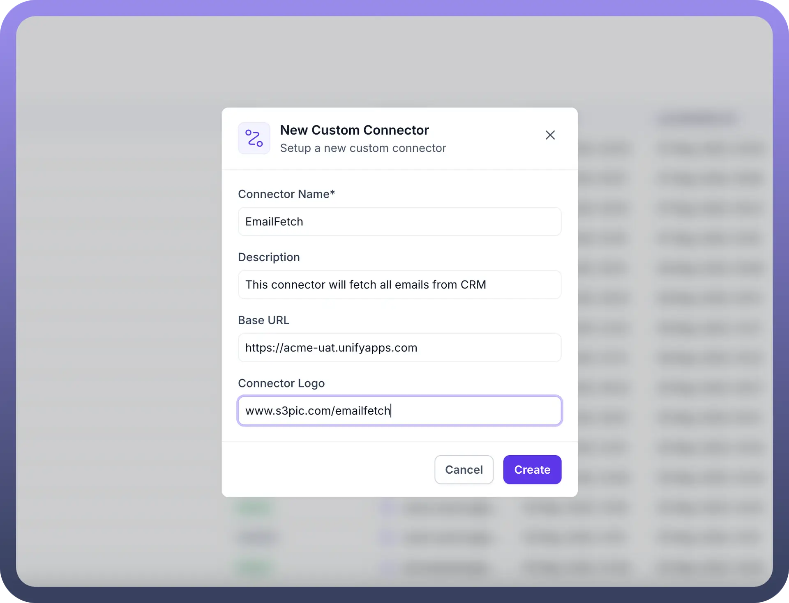

**Step 3: Configure connector settings**

Once the connector has been added, move to the next screen to configure connector settings.

Section 1:  Authentication

In this section, the authentication type for the connector can be defined. Please note that multiple authentication mechanisms can be added at the same time, but 1 type of authentication can be added only once.

- Click on `New Authentication` on the top right
- Provide `Name` of the authentication mechanism
- Provide a detailed `Description` for future references
- Select from different `Authentication Type`
  - Access Token
  - JWT Auth
  - OAuth 2.0
  - Basic
  - Custom

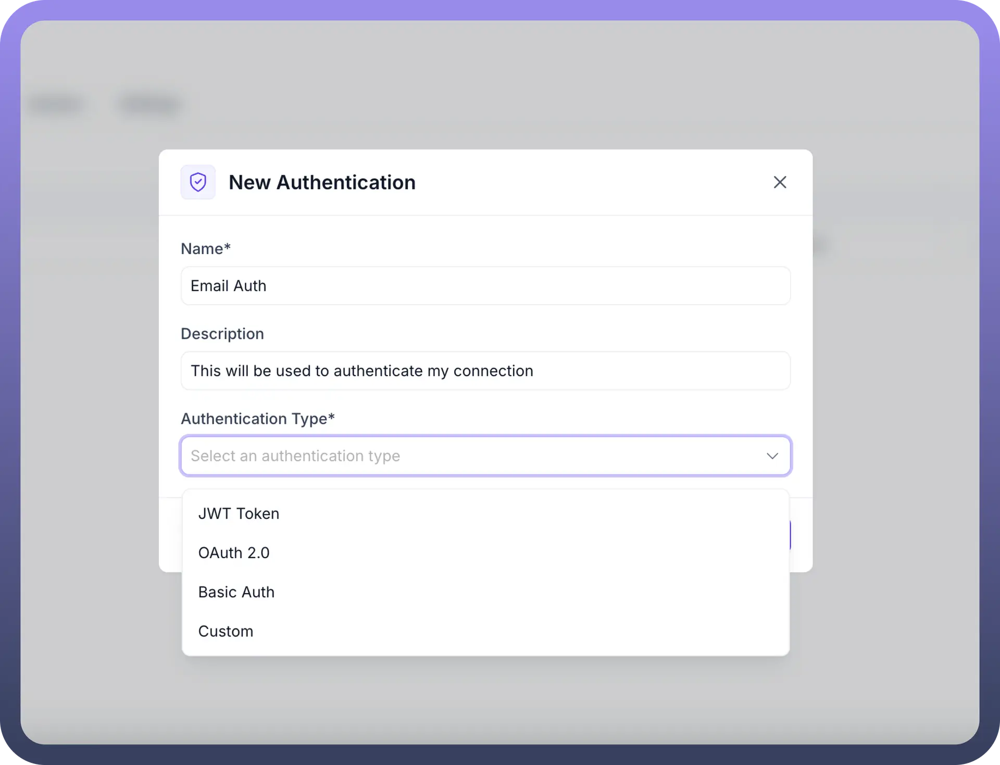

Once user click on `Create`, user will land onto the next screen where more details need to be provided as per the Type of authentication selected

- **Access Token**
  - Define the `Input schema` for this authentication
  - Provide `Headers/Tokens` & other necessary information shown in the screenshot below to setup the authentication mechanism

    

- **JWT Token**
  - Define the `Input schema` for this authentication
  - Define the `Output schema`
  - Provide `Private Key`, `Signing algorithm` & other necessary information shown in the screenshot below to setup the authentication mechanism

    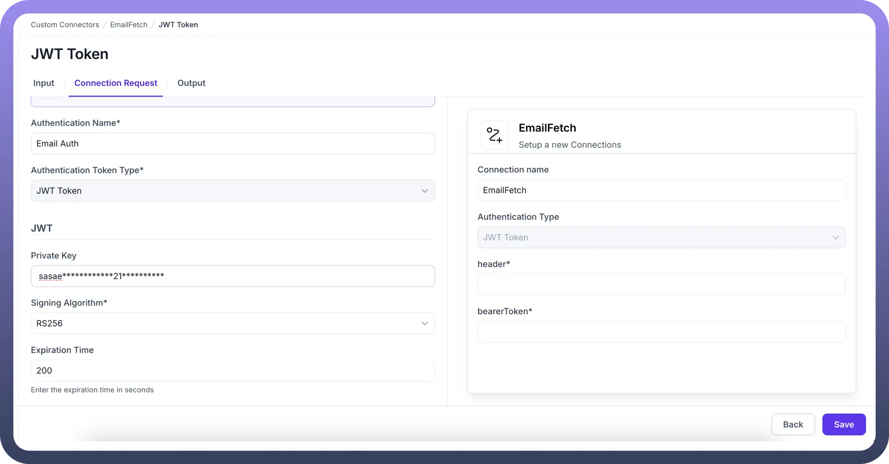

- **OAuth 2.0**
  - Define the `Input schema` on for this authentication
  - Provide `Client ID` , `Secret ID` & other necessary information shown in the screenshot below to setup the authentication mechanism

    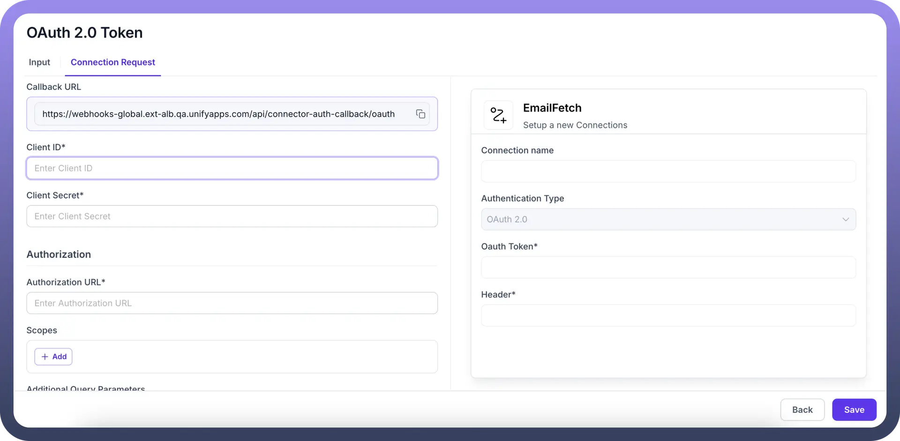

- **Basic**
  - Define the Input schema on for this authentication
  - Provide UserName & Password & other necessary information shown in the screenshot below to setup the authentication mechanism

    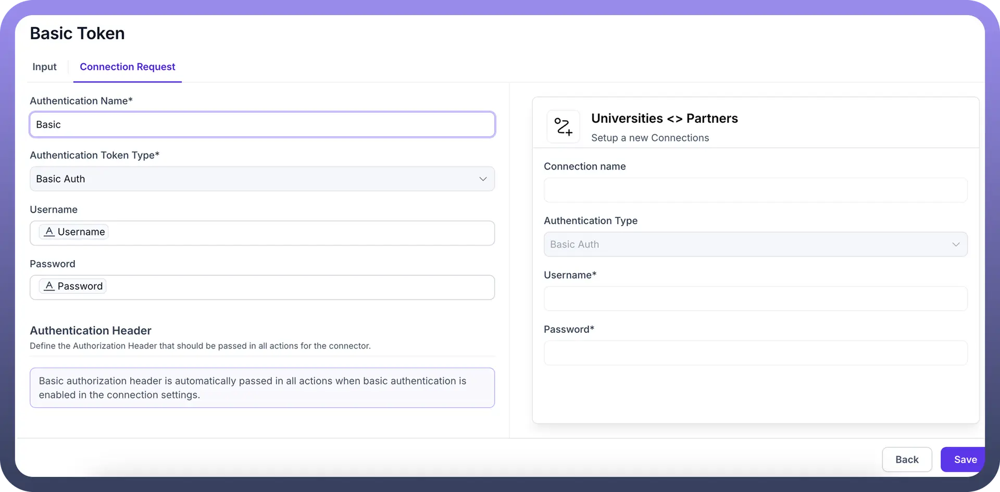

- **Custom**
  - Define the Input schema on for this authentication
  - Provide Token & other necessary information shown in the screenshot below to setup the authentication mechanism

    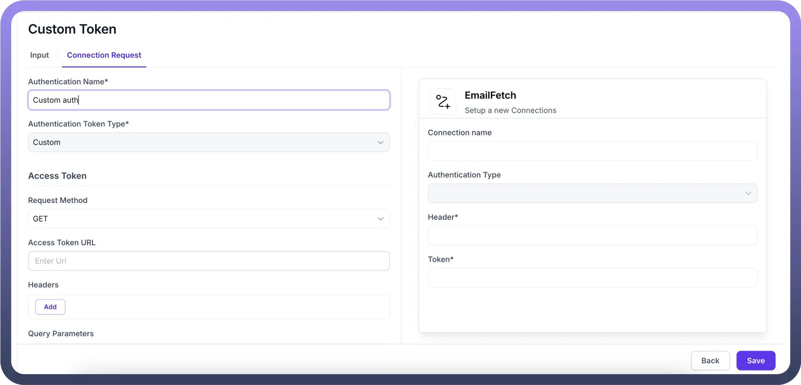

Section 2: Triggers

In this section, Triggers can be defined on which the connection should get activated .

- Click on `New Trigger` on the top right
- Provide `Name` of the Trigger
- Provide a detailed `Description` for future references
- Select from different Type
  - `Webhook`
  - `Polling`

    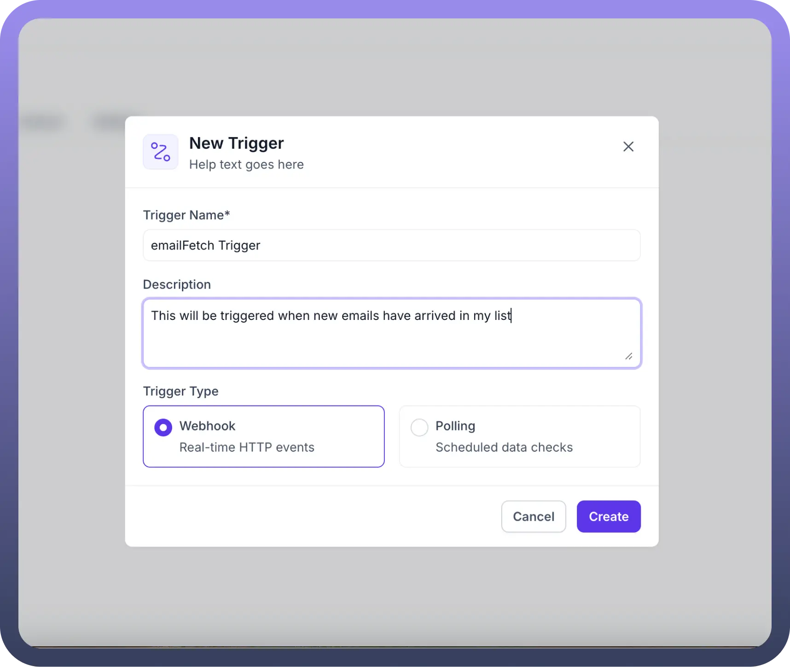

**Trigger Type = Webhook**

This type trigger works on setting up webhooks and gets activated as soon as an event is received on the webhook

- To set this up, define the `Input schema`
- Choose `Webhook Registration Type` - either `Manual` or `Automatic`

  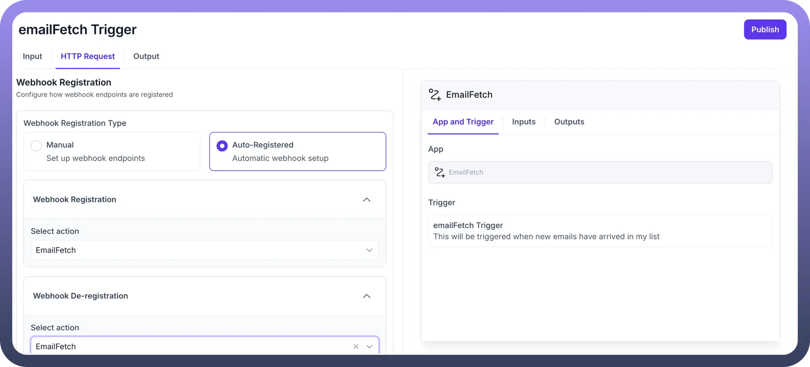

**Trigger Type = Polling**

This type trigger depends on regular polling  on setting up webhooks and gets activated as soon as an event is received on the webhook

- To set this up, define the `Input schema`
- Choose `Pagination config` & other necessary settings as shown in the screenshot below

  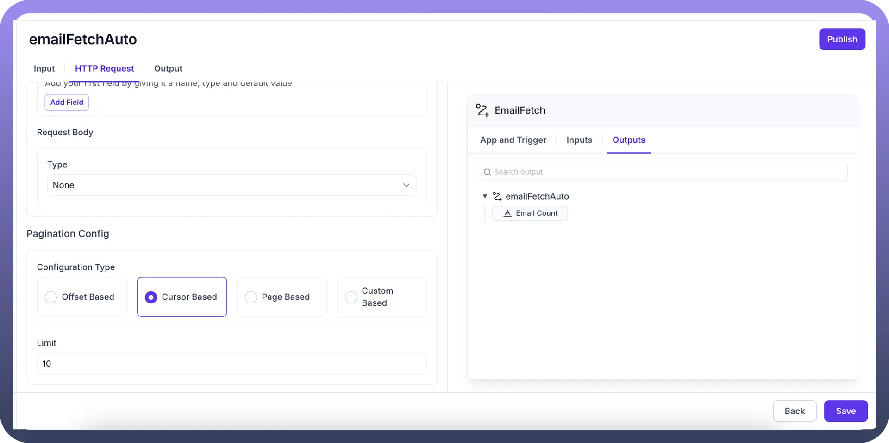

Section 3: Actions

In this section,  Actions can be defined which need to be executed once a trigger is received on this Custom Connector SDK .

- Click on `New Actions` on the top right
- Provide `Name of the Action`
- Provide a detailed `Description` for future references
- Define the action details in the next section. For e.g. in the screenshot below, we are using GET action targeted from the entered URL

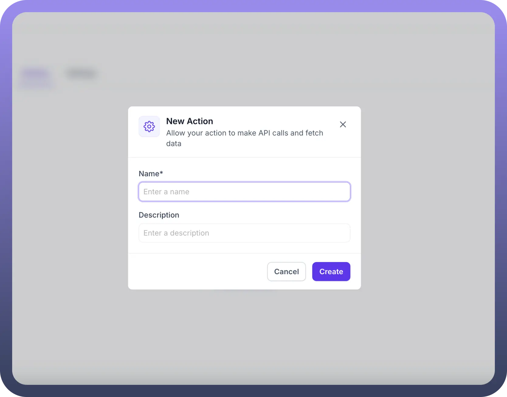

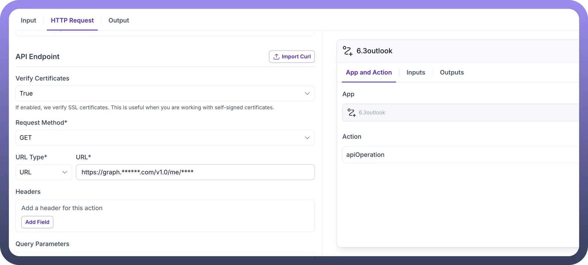

Section 4: Settings

Under settings, user can define

1. **Object Type**
  - Two options are available: Dynamic & Static
  - If Dynamic is selected, no input is needed
  - If Static is selected, user will have to create the List Object Schema to use this
2. **Availability of this connector in Pipeline**
  - Switch On the toggle to enable this in Pipeline
  - Once switched On, different actions need to be mapped from Pipeline to this connector
  - All standard Pipeline actions are available in the left column, and can be mapped to the list of Actions which have been created in this Connector SDK
3. **Availability of this connector in Automation**
  - Switch On the toggle to enable this in Automation

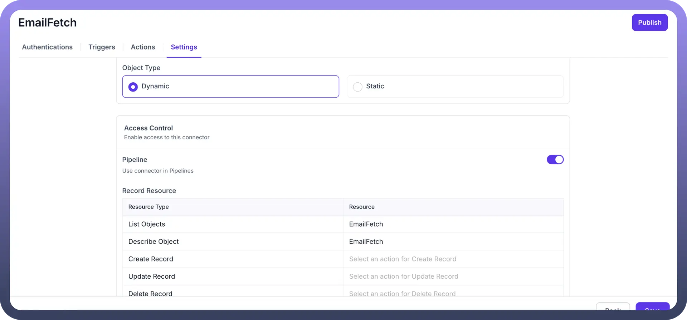

Step 4: Publish the connector

Once all settings have been configured, click on `Publish` to start using the custom SDK connector

## Best Practices

1. **Use Descriptive Names:** Give user Custom Connector SDKs and its settings clear, descriptive names that indicate their purpose and destination.
2. **Include Detailed Descriptions**: Add comprehensive descriptions to help reviewers understand the purpose and scope.
3. **Review Authentication Thoroughly**: Since authentication is the key for these connections to work, ensure that all endpoints and tokens are configured correctly
4. **Test After Connection**: After creating any connection, test the connection using sample/dummy values
