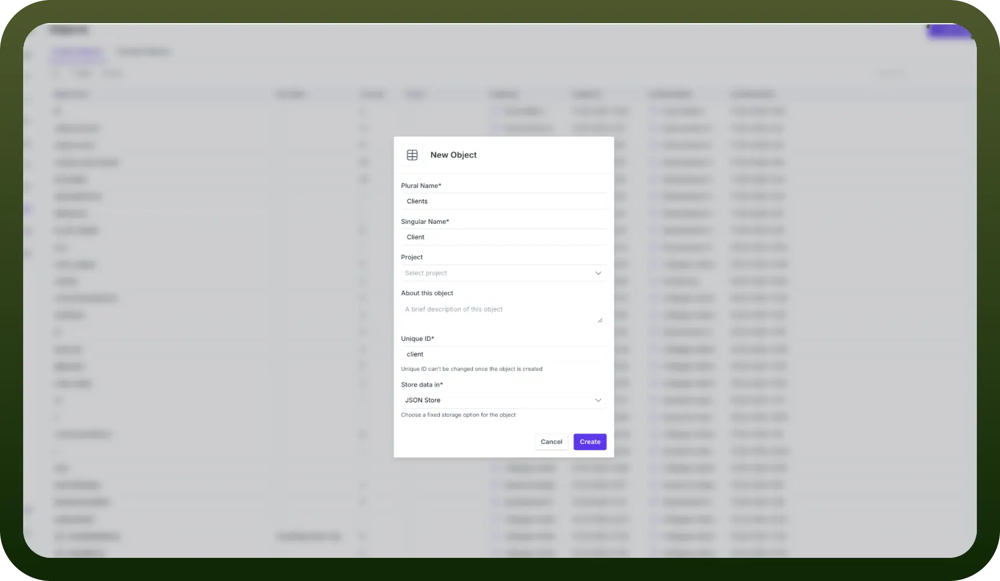
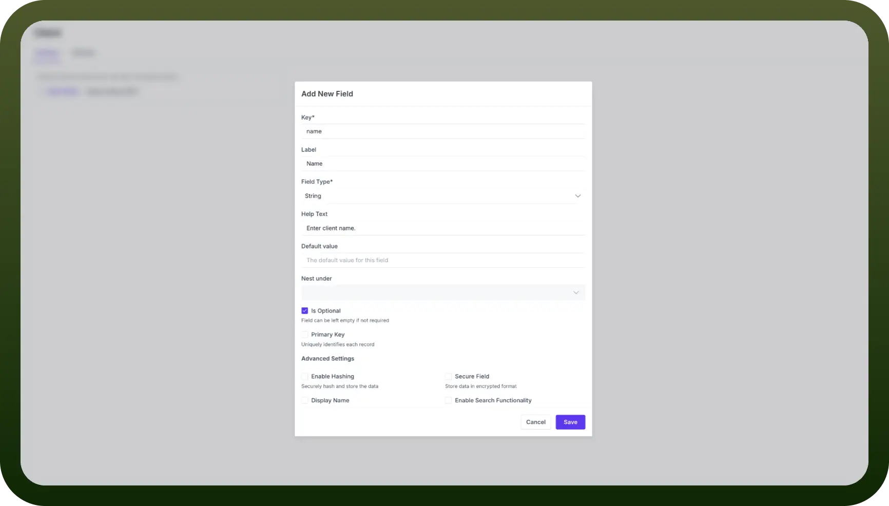
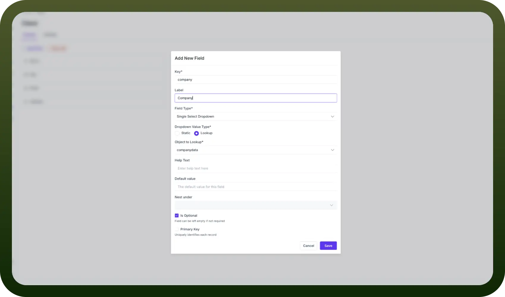

# Create your first Object

Source: https://www.unifyapps.com/docs/platform-tools/create-your-first-object
Section: platform-tools

---

## How to Create an Object?

Let's create an object from scratch.

1. Click on `New Object` to start creating an object. A modal should open up, asking for basic information regarding the object.

  

2. Fill in the plural and singular names for your object. Also, select the data storage mechanism type based on your needs. The available options are JSON store, Blob store, Key-value store, Event store, and Blob store. Each of these is explained in a later section.
3. Click on `Create`, and you'll be taken to the landing page of your object, where you can design the schema of your object and enable additional configurations in settings.

### Setting up your Schema

- You can add fields to your object's schema in bulk by pasting a sample JSON. Additionally, you can modify your schema by adding fields one by one.

  

- Once you click on `Add Fields`, a modal opens up, prompting you to describe the nature of your new field. You'll be required to set the following parameters:

| **Parameter** | **Description** |
|---|---|
| `Key` | The unique identifier for the field within the object. |
| `Label` | A human-readable name for the field. |
| `Field Type` | Specifies the data type of the field, which can be number, string, etc. |
| `Help Text` | A brief explanation for users about the field's expected input. |
| `Default Value` | The value is automatically assigned to this field when creating a new record if no other value is provided. |
| `Nest Under` | Allows for hierarchical data structuring by making this field a sub-field. |
| `Is Optional` | When checked, it indicates that the field is not required and can be left empty. |
| `Primary Key` | When checked, this field is designated as the unique identifier for each record in the object. |

- You can also use advanced settings to customise field behaviour, enhance security, and control data visibility and accessibility. The following are the available parameters:

| **Parameter** | **Description** |
|---|---|
| `Enable Hashing` | When checked, this option securely hashes and stores the data. |
| `Secure Field` | This option allows data to be stored in an encrypted format. |
| `Display Name` | It allows the field's content to be visible when viewing associated data across the system. |
| `Enable Search Functionality` | This option permits searching in this field. |
| `Enable Sorting` | Allows sorting of records based on this field. |
| `Enable Filtering` | This option allows the filtering of records using this field. |
| `Control Visibility` | This toggle switch activates a set of customisable conditions to control the visibility of this field. |

- Once you have added all the required fields, click save. The schema can be modified later at a later point in time.

### Import Records

- You can easily bulk-add records to your object using the import feature to save time and effort.
- Click on `Import` from the object landing page, and a modal will appear where you can upload csv, xlsx or xls file types.
- Once you upload a file, click `Review Data` to map your file's fields with the corresponding fields in your object. If the field names in your file match that of the object, then it should already come pre-mapped, and you can just crosscheck once.
- Once the fields have been mapped, click on `confirm`, and your records should reflect in your object.

### Export Records

- You can easily export records in various file formats using the export feature to extract data from your object.
- Click on `Export` from the object landing page, and a dropdown will appear where you can select your preferred export format from csv, xlsx, or xls.
- You can choose to export either all records or filtered records based on your current view or search criteria.
- The export will be processed in the background for large datasets, and you'll receive a notification when your file is ready to download.
- Exported files maintain field names and data types as defined in your object, making reimport easy.
- In your application builder, set up a data source which fetches records from your object using Storage by UnifyApps.

## Types of Data Stores

There are five types of data stores, each with its capabilities and use cases.

- `JSON Store`**:** Used to store data in JSON format. Typically implemented using DocumentDB or **MongoDB**, depending on the cloud provider. This is the most common way of storing data in objects.
- `Blob Store`**:** Primarily used for large unstructured data like files or images. Implemented using services like **S3 in AWS** or equivalent services in other cloud providers (like Google Cloud Storage in GCP or Azure Blob Storage).
- `Key Value Store`**:** Used to store simple key-value pair data. Typically implemented using **Redis**, offering fast access and caching capabilities.
- `Event Store`**:** Stores time-series data or event logs. Implemented using **Apache Kafka**, enabling real-time event streaming and processing.
- `Vector Store`**:** Used for storing and querying vector embeddings, often used in machine learning applications. Typically implemented using **OpenSearch**, enabling efficient similarity searches.

## Types of Fields

| **Field Type** | **Description** | **Example use cases** |
|---|---|---|
| `String` | Used for storing text-based data | Names, descriptions, addresses |
| `Number` | Used for storing floating number data | Prices, measurements and percentages |
| `Integer` | Used for storing non-decimal numbers | Age, count and quantity |
| `Auto Number` | Automatically generated sequential numbers | Ticket IDs and reference numbers |
| `Boolean` | Used for storing true/false values | is_active, is_completed and has_subscription |
| `Date` | Used for storing dates as epochs | Birth date and expiry date |
| `Date Time` | Used for storing data and time combined as epochs | Modified time and event timings |
| `Single Select Dropdown` | Used for selecting a single option from either a static or lookup list | Status, category and priority |
| `Multi Select Dropdown` | Used for selecting multiple options from either a static or lookup list | Tags, categories and preferences |
| `Object` | Used for complex data structures comprising multiple fields nested inside them | Employee details and other nested structures |
| `Array` | Used for storing a list of values of the same type | Phone numbers and email addresses |
| `File` | Used for storing file attachments | Documents, images and attachments |

## Lookups

Lookups allow you to reference data from other objects in your current object, creating relationships between different data sets. Here's how to set up and use lookups:

- When creating a Single Select or Multi Select Dropdown field, you can choose '`Lookup`' as the source of options instead of a static list.
- Select the target object from which you want to look up data. The field used to join the two objects must be a primary key in your lookup object.

  

- In your lookup object, set the field you want to act as a display name by ticking the display name checkbox in the edit field modal.
- Now, you can access data from your secondary object, thus enabling you to create cleaner and non-repetitive objects.
