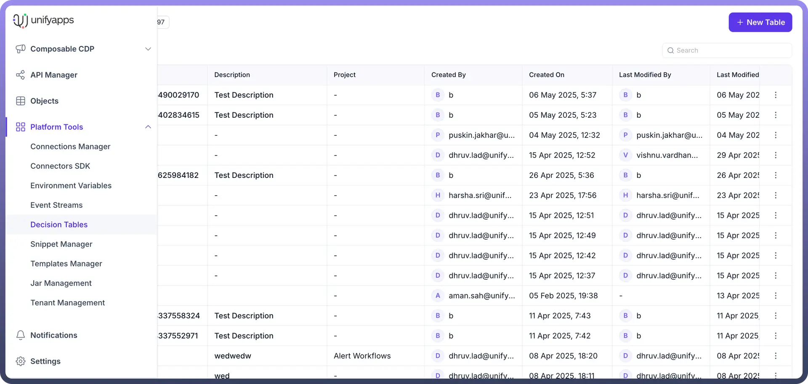
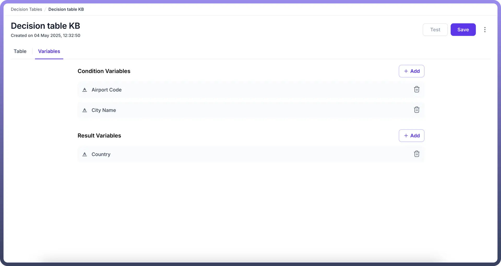
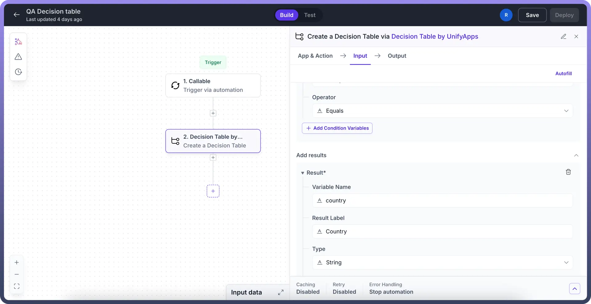
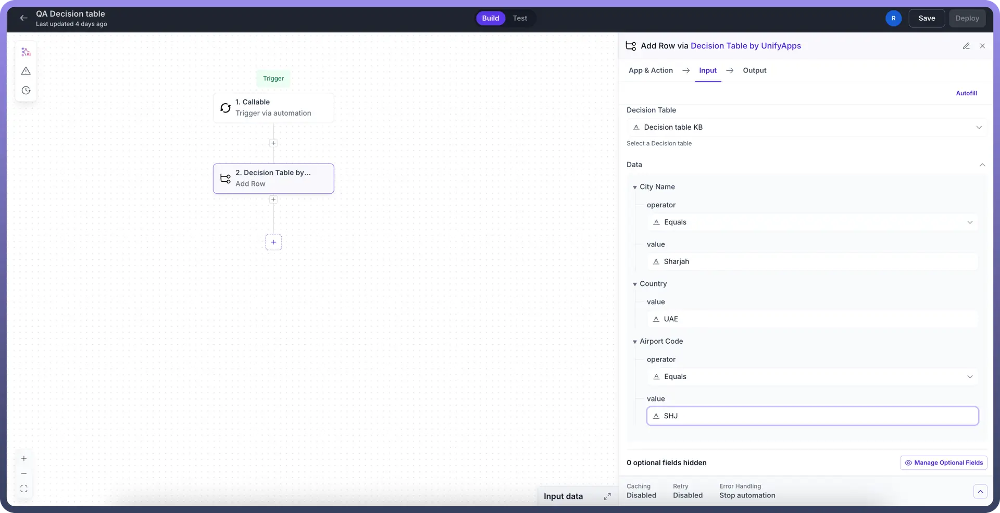
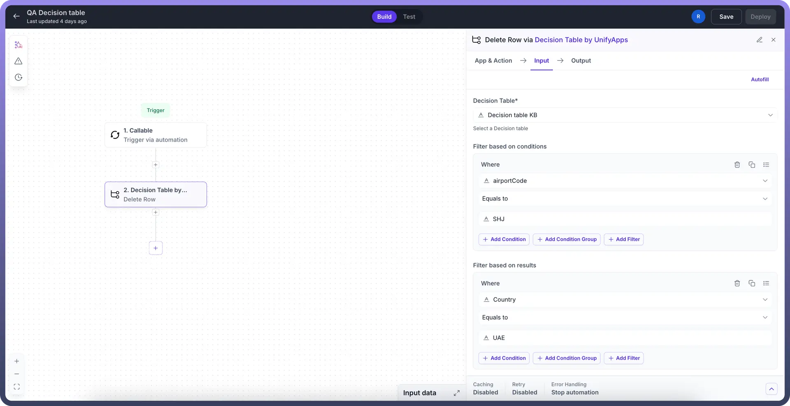
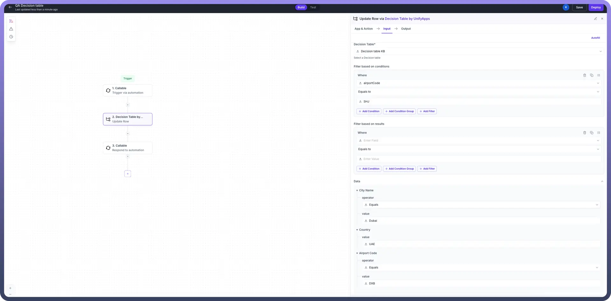
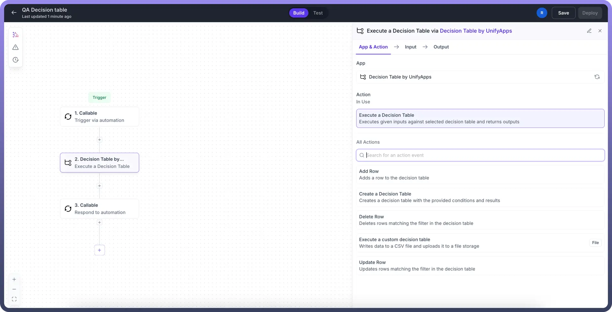
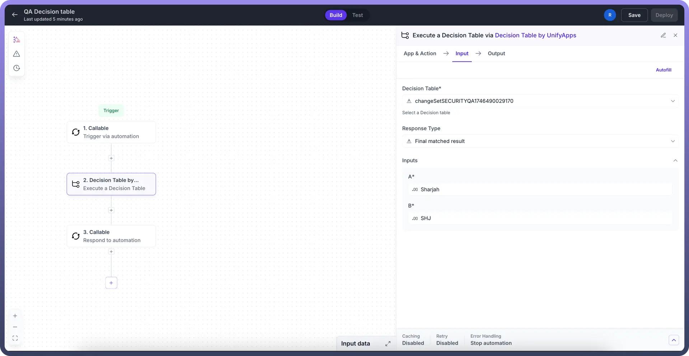

# Decision Table

Source: https://www.unifyapps.com/docs/platform-tools/decision-table
Section: platform-tools

---

## Overview

A **Decision Table** is a powerful **mapping tool** within our platform that allows you to define rules for determining output values based on specific input conditions. It functions as a structured lookup mechanism where users can define condition variables with specific operators (like "equals," "starts with," etc.) and corresponding result variables.Decision Tables help you implement complex business logic without coding by creating clear relationships between input conditions and desired outcomes.

## Configuring a decision table

1. **Access the Decision Table**
  - Navigate to the platform tools>Decision tables
  - Click on the new table button to create a new decision table.

    

2. **Define condition,result variables**
  - Add Condition variables that will determine your results.
  - For each condition variable, specify Field name,Data type (text, number, date, etc.), Condition operator (equals, starts with, contains, greater than, etc.)
  - Add the output fields your table will return
  - Specify the data type for each result variable

    

3. **Add records in decision table**
  - We can either add records in the decision table by manually creating them from table layout, or use one of the actions defined below to create, update and delete records.

## Actions in a decision table

1. **Create a Decision Table:**
  - Provide a name and description for the decision table.
  - Add Condition variables that will determine your results.
  - For each condition variable, specify Field name,Data type (text, number, date, etc.), Condition operator (equals, starts with, contains, greater than, etc.)
  - Add the output fields your table will return
  - Specify the data type for each result variable

    

2. **Add row to existing decision table:**
  - The action allows users to create a new record in an existing decision table.
  - Users can provide the value of each condition variable along with the operator to match when the decision table is executed.
  - For each defined condition variable, users should define the relevant output as the result variable.

    

3. **Delete rows from existing decision table:**
  - The action allows users to delete a record from an existing decision table.
  - Users can provide the filter conditions to match the records to be deleted.
  - Using this action will delete the matched record from the decision table.
  - Users are allowed to filter the records via condition variables as well as result variables.

    

4. **Update rows in an existing decision table:**
  - The action allows the user to update an existing record in a decision table.
  - In order to update a record users should provide filter conditions to identify the record to be updated.
  - The filter conditions can be defined on the basis of existing condition variables or the result variables.
  - Finally users should provide the updated value of the condition and result variables which will override the existing value for the filtered record.

    

5. **Execute a custom decision table**
  - Within actions in unify apps search for a decision table by unify apps, an action to execute a decision table is present.

    

  - Choose the decision table you want to execute from the available dropdown, choose from one of the available response types:
    - **Final matched result** : Based on the inputs passed corresponding to condition variables defined in your decision table, this action returns the final matched result from the records present in the decision table
    - **All matched result :** Based on the inputs passed corresponding to condition variables defined in your decision table, this action returns all the matched result from the records present in the decision table
    - **First matched result :** Based on the inputs passed corresponding to condition variables defined in your decision table, this action returns the first matched result from the records present in the decision table

      
