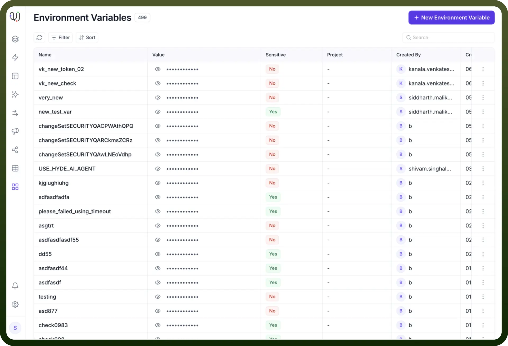
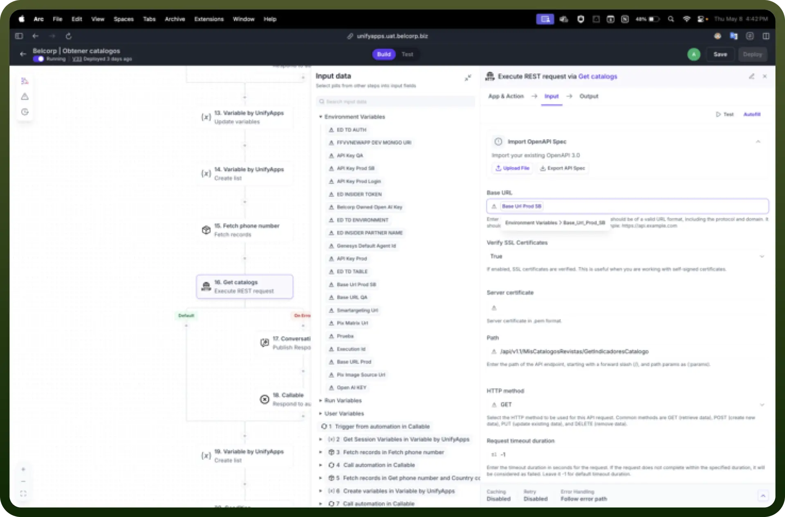
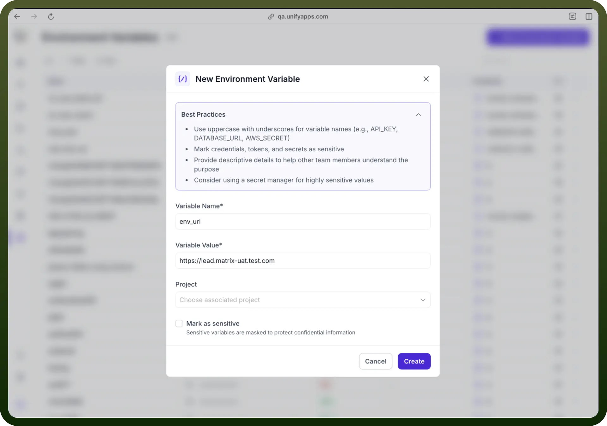
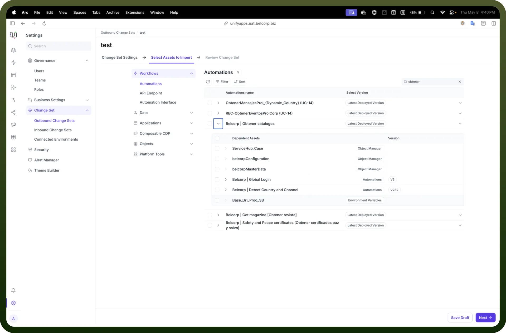

# Environment Variables

Source: https://www.unifyapps.com/docs/platform-tools/environment-variables
Section: platform-tools

---

## Overview

Environment Variables in the UnifyApps platform are dynamic key-value pairs that allow you to configure environment-specific values used across APIs, and automations. Similar to how environment variables function in traditional software development, these variables isolate critical values—such as URLs, tokens, or feature flags—specific to a given environment (e.g., dev, UAT, prod), ensuring seamless portability and environment isolation.

These variables are resolved at runtime based on the environment in which the asset is deployed, enabling streamlined configuration without manual code changes.

## Key Capabilities & Use Cases

**Environment-Specific Configuration**

Each environment variable is bound to the environment in which it is created. If the same key is referenced in another environment, its value will differ based on that specific environment’s configuration.

- Enables smooth deployments across UAT, staging, and production
- Prevents hardcoded values in workflows
- Supports environment-scoped values like API base URLs, keys, and flags

**Storing Secrets Securely**

Marking a variable as **sensitive** masks its value in the platform interface and ensures its secure storage. This is especially useful for:

- API Tokens and Authentication Keys
- Webhook secrets
- Encrypted database URIs

**Used in Automations and APIs**

Environment variables can be referenced inside:

- REST API steps (Base URLs, headers, params)
- Callable automations
- Node configurations

They help in dynamically adapting the behavior of these elements per environment.

## How to Create an Environment Variable?

To create a new environment variable, follow these steps:

1. Go to `Platform Tools` **→** `Environment Variables` **→** `+ New`
2. Enter a `Variable Name` using uppercase letters and underscores (e.g., BASE_URL_PROD)
3. Enter the `Variable Value` appropriate for the environment
4. Optionally, assign it to a `Project`
5. Check `Mark as Sensitive` if the value is confidential (e.g., tokens, secrets)
6. Click `Create`

**Example:**

| **Variable Name** | **Variable Value** |
|---|---|
| BASE_URL_UAT | https://lead.matrix-uat.test.com |
| AUTH_TOKEN | abcdefgh1234567890 (Marked as Sensitive) |

> **Note:** When an automation or application using environment variables is **exported via a change set** to another environment the **variable key is retained** but the **value is not transferred**.

## Best Practice

Exclude environment-specific variables from the change set OR ensure the same keys exist in the destination environment with updated values.
