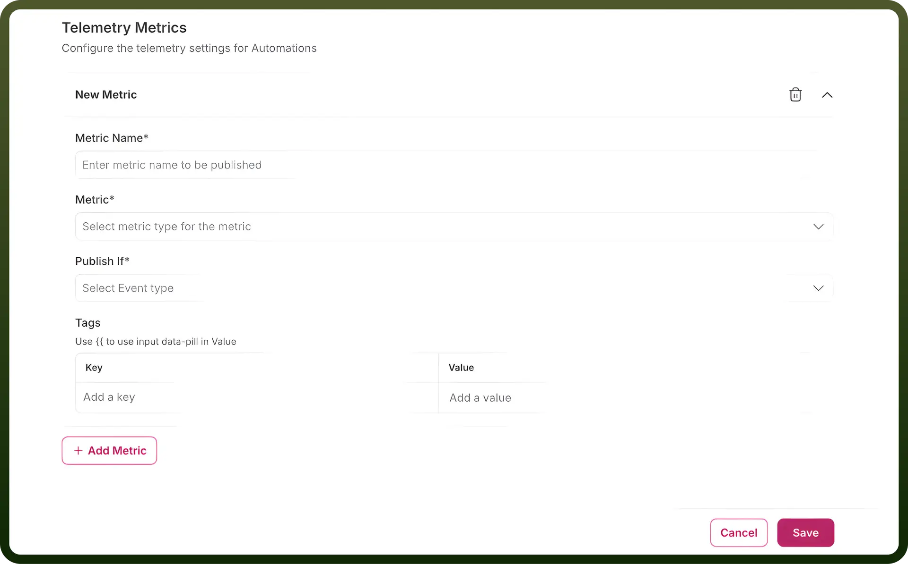
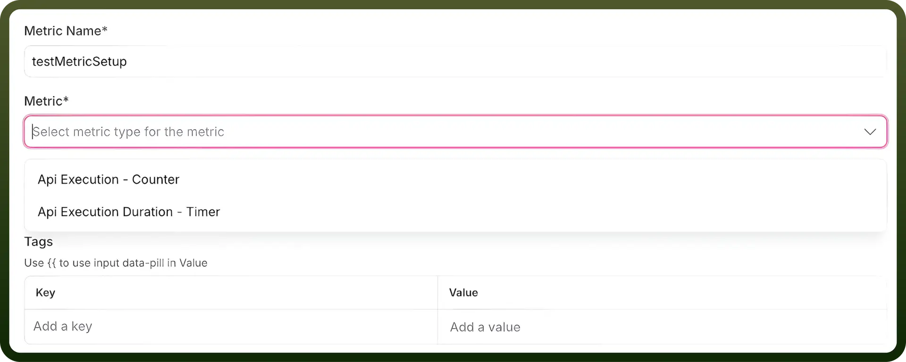
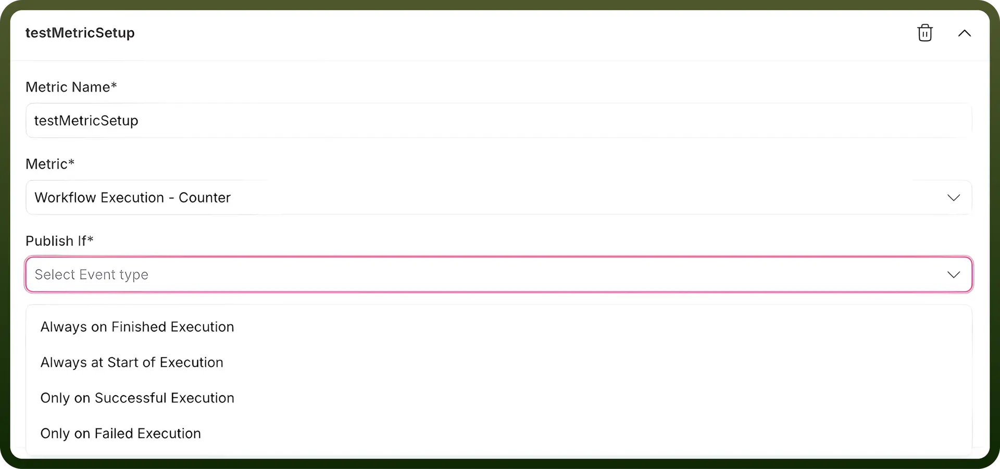
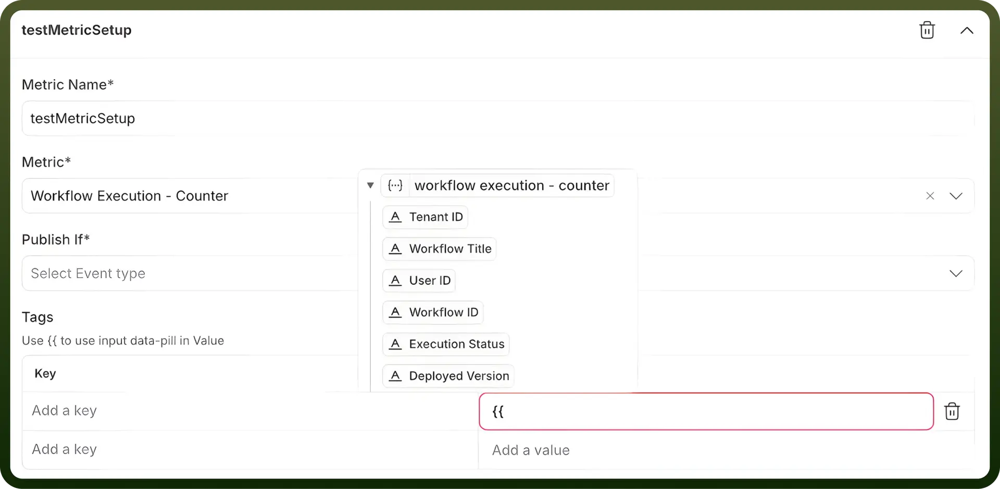
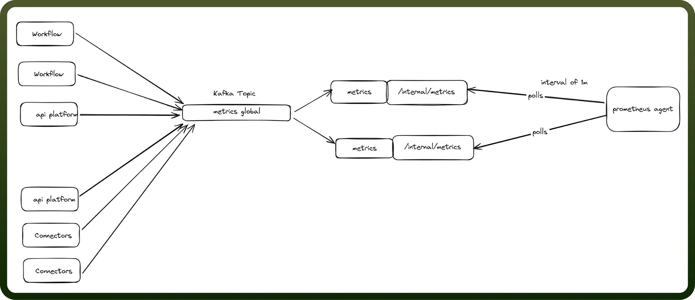

# Open Telemetry

Source: https://www.unifyapps.com/docs/platform-tools/open-telemetry
Section: platform-tools

---

## **Overview**

UnifyApps' OpenTelemetry feature enables users to publish telemetry metrics to **Prometheus**, allowing for enhanced analytics and logging of platform features. These metrics provide valuable insights into the performance and behavior of key platform components, supporting better monitoring, debugging, and decision-making processes.

Telemetry metrics can be published across the following **three asset classes**:

1. `Automations`: Metrics can be configured at various levels, including:
  - **Node Level**: Metrics for individual node performance.
  - **Individual Automation Level**: Metrics for specific automations.
  - **Global Automation Level**: Metrics for all automations across the platform.
2. `Connections`: Metrics can be published at:
  - **Individual Connection Level**: Metrics for specific connections.
  - **Global Connections Level**: Metrics for all connections on the platform.
3. `APIs`: Metrics can be configured at:
  - **API Group Level**: Metrics for specific API groups.
  - **Global APIs Level**: Metrics for all APIs on the platform.

These published metrics are logged in the **Prometheus account** linked to the relevant environment, enabling platform administrators to monitor system performance and usage at varying levels of granularity.

## Key Features of Telemetry in UnifyApps

1. `Metric Formats`:
  - Metrics can be configured in **two formats**:
    - **Counter**: Tracks the number of occurrences for a specific action or event.
    - **Timer**: Measures the time taken for a specific action or event.

      

2. `Publish Situations`:
  - Metrics can be configured to publish for different events across the asset classes
  - For Automations:
    - **Always on Finished Execution**: Metrics are published after the completion of an execution, regardless of its outcome.
    - **Always at Start of Execution**: Metrics are published at the beginning of an execution.
    - **Only on Successful Execution**: Metrics are published only when the execution is completed successfully.
    - **Only on Failed Execution**: Metrics are published only when the execution fails.
  - For Connections:
    - **Always**: Metrics are published for every connection event.
    - **On Successful Events**: Metrics are published when a connection event succeeds.
    - **On Error Events**: Metrics are published when a connection event encounters an error.
  - For APIs:
    - **Always**: Metrics are published for every API event.
    - **On Successful Events**: Metrics are published when an API call succeeds.
  - **On Failure Events**: Metrics are published when an API call fails.

    

3. `Tags`:
  - Users can configure **key-value pairs** corresponding to the asset class, allowing customization of logged data.
  - As shown in the screenshot:
    - **Tags** can be added as keys, and values are logged for each event.
    - **Datapills** can be mapped to keys, passing dynamic values to the log for every event. This enables differentiation between events and provides detailed insights into the event logs.

Available tags-values corresponding to the asset classes:

| Asset Class | Level | Fields Available |
|---|---|---|
| 1. `Automations` | Node Level | App Name, Tenant Id, Workflow Title, Resource Name, User Id, Node Id, Workflow Id, Execution Status, Deployed Version |
|  | Automation Level | Tenant Id, Workflow Title, User Id, 
Workflow Id, Execution Status, Deployed Version |
|  | Global Level | Tenant Id, Workflow Title, User Id, 
Workflow Id, Execution Status, Deployed Version |
| 2. `Connections` | Connection Level | App Name, Connection Id, Resource Name, Connection Name, Outcome |
|  | Global Level | App Name, Connection Id, Resource Name, Connection Name, Outcome |
| 3. `APIs` | API Group | Collection Path, Endpoint Id, Http Method, User Id, API Path, Http Status, Tenant Id, Host, Cache Hit, API Client Id, Auth Type, Collection Id, Outcome |
|  | Global Level | Collection Path, Endpoint Id, Http Method, User Id, API Path, Http Status, Tenant Id, Host, Cache Hit, API Client Id, Auth Type, Collection Id, Outcome |

## Implementation Details

## Metrics Architecture

### Data Flow

- Applications (workflow, api-platform, connectors) → metrics Kafka topic
- Events are micro-batched for efficiency with minimal delays
- Metrics Consumer reads Kafka topic → exposes Prometheus metrics via internal/metrics
- Prometheus agent scrapes metrics from all application pods

### Why Centralized Metrics?

Instead of direct Prometheus exposure from each app, we use a dedicated metrics service because:

- Protects core apps from memory issues
- Handles user-configurable tags that cause high cardinality
- Prevents OOM crashes by isolating Micrometer's memory-intensive tag caching.
