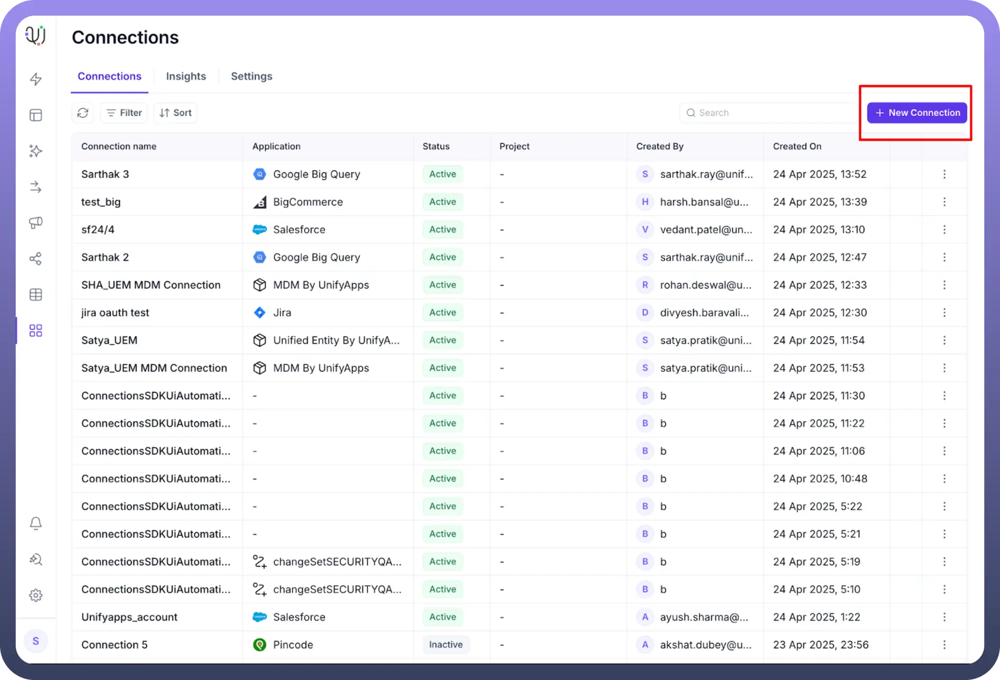
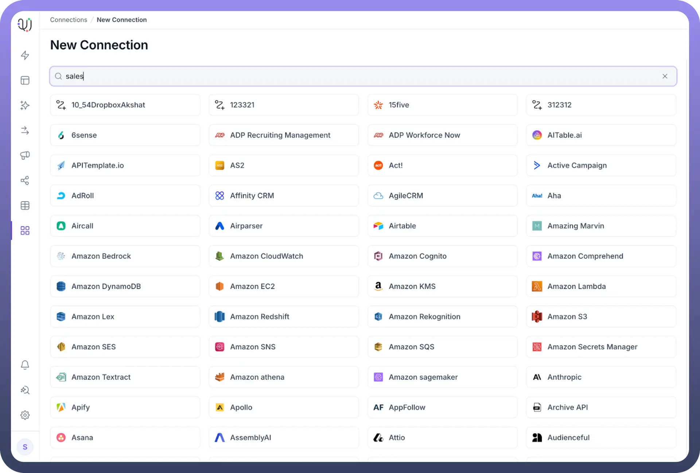
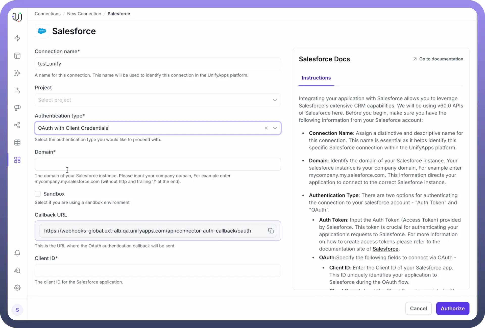
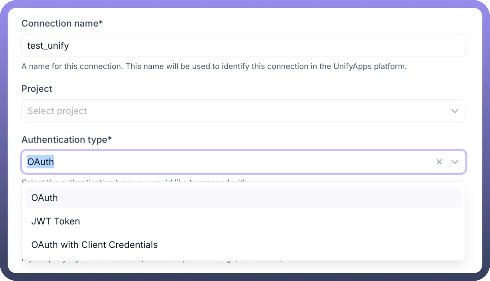

# Set Up Your First Connection

Source: https://www.unifyapps.com/docs/platform-tools/set-up-your-first-connection
Section: platform-tools

---

## Overview

This guide walks you through connecting your first external application or service to the Unify Apps platform using the Connection Manager. Connections are the secure links that allow your Unify Apps automations and applications to access data and perform actions in other systems like CRMs, communication tools, databases, and more. Creating connections is the foundational step for building powerful integrations.

## Prerequisites

Before you start creating your first connection in Unify Apps, make sure you have the following ready:

1. **Access to your Unify Apps Account:** You need to be logged into the platform.
2. **Information for the Application You Want to Connect:** This is the most crucial part and varies depending on the application. You will need:
  - **Knowledge of the Authentication Method:** Does the application use an API Key, Basic Authentication (Username/Password, potentially an App-Specific Password), OAuth 2.0 (where you log in to the app to grant access), or another method like JWT? Check the application's developer documentation if unsure.
  - **Specific Credentials:**
    - The actual API Key.
    - Username and Password (or App-Specific Password if required by the service, especially if MFA is enabled).
    - OAuth 2.0 requires you to log in during the setup, but you might need details like Client ID/Secret if Unify Apps requires manual OAuth app setup for that connector.
    - Server Hostname, Port number, Database name, Domain, etc., if connecting to databases, FTP servers, or specific enterprise systems.
  - **Necessary Permissions:** Ensure the account or credentials you are using have the required permissions *within the external application* to perform the actions you intend (e.g., read contacts, post messages, update records).

## Step-by-Step Guide

Follow these steps to create and configure your connection:

1. **Initiate a New Connection** Once you are in the Connection Manager section of the Unify Apps platform, locate and click the “`New Location`” button to add a new connection. **Select the Application** You will see a list or a searchable catalog of applications and services that you can connect to. Find the application you want to connect (e.g., Slack, Salesforce, Google Sheets, MySQL). Click on the application to select it.

  

  

  

2. **Configure the Connection Details** Now you'll configure the specific details for this connection instance:
  - `Connection Name`**:** Enter a unique and descriptive name for the connection in this field. This helps you identify it later (e.g., "My Production Salesforce", "Marketing Team Slack"). *Best Practice:* Use a name that indicates the application and its purpose or environment (e.g., "Personal Gmail Account", "Airtable - Marketing Campaigns Base", "Shared Support IMAP Mailbox"). This is crucial if you plan multiple connections to the same type of application.
  - `Authentication Type`**:** Select the authentication method supported by the application and required for your use case from the available options (e.g., API Key, Basic Auth, OAuth 2.0). This selection *must* match the type of credentials you obtained from the external application.
  - **Enter Credentials/Details:** Fill in the required fields based on the selected authentication type. This is where you'll use the information gathered in the Prerequisites step. Fields might include:
    - `API Key`
    - `Username` and `Password`
    - `Host`, `Port`, `Database`
    - `Domain`
    - `Client ID`, `Client Secret` (less common for direct user input, often handled by the OAuth flow.
    - If `API Token/Key`: Paste the obtained token/key value into the designated field.
    - If `Basic Authentication`: Enter the Username and Password into their respective fields.
    - If `OAuth 2.0`:
      - You might need to enter a Client ID and Client Secret if manually configured.
      - More commonly, click the `Authorize` or `Connect` button.
      - A pop-up window or browser redirect will likely occur, taking you to the Google login page. Log in if prompted.
      - Grant the requested permissions (scopes) to Unify Apps.
      - Upon successful authorization, you will be redirected back to the Unify Apps connection setup screen. Ensure pop-up blockers are temporarily disabled and you authenticate correctly on the site.
    - Other Fields: Input any additional required details like *Host , Port* , or toggle *SSL/TLS* settings as needed, based on the specific connector (e.g., IMAP vs. Gmail connector) and your gathered prerequisites.

## Common Authentication Types & Key Inputs

| **Authentication Type** | **Key Inputs Typically Required in Unify Apps** | **General Guidance on Finding Inputs (in External App Settings)** |
|---|---|---|
| `API Key / Token` | Connection Name, API Key/Token Value | Look under 'API', 'Developer Tools', 'Integrations', or 'Security' sections. Generate a new key if needed. |
| `Bearer Token` | Connection Name, Bearer Token Value | Often synonymous with API Key/Token but specifically used in Authorization: Bearer <token> headers. Found in similar locations ('API', 'Developer Tools'). |
| `Basic Authentication` | Connection Name, Username, Password (or App Password) | Standard login credentials. App Password likely needed for services like Gmail/Google if MFA/2FA is enabled (generate in account security settings). |
| `OAuth 2.0` | Connection Name, (Click Authorize Button), potentially Client ID & Client Secret for specific setups | Clicking 'Authorize' usually redirects to the app's login. For setups requiring Client ID/Secret, you'd typically need to register Unify Apps as an 'OAuth App' in the external service's developer settings. Requires specifying Scopes & Callback URL. |
| `JWT Token` | Connection Name, Consumer Key (Client ID), Private Key (file upload or text), Username (of service user) | Used by services like Salesforce. Requires significant setup in the external app: creating a 'Connected App', generating a private key/certificate pair (e.g., using OpenSSL), and uploading the certificate. |
| No Authentication | Connection Name | Used for connecting to public APIs or resources that don't require authentication. No credentials needed. |

> **Note:** For **OAuth 2.0**, instead of entering credentials directly here, you will likely see an `Authorize` button. Clicking this will redirect you to the application's login page in a new window or popup. Log in there to grant Unify Apps access.

## Troubleshooting Common Setup Issues

If your connection test fails or you encounter errors, check these common areas:

- **Incorrect Credentials:** Double-check API keys, usernames, passwords (or app-specific passwords), tokens, etc., for typos or inaccuracies. Ensure API keys haven't expired.
- **Wrong Authentication Method:** Make sure you selected the authentication method that matches the credentials you have and is supported/required by the target application.
- **Incorrect Connection Details:** Verify hostnames, port numbers, database names, domains, etc., are correct.
- **Insufficient Permissions/Scope:** The credentials used might not have the necessary permissions within the external application (e.g., the user lacks API access, or the OAuth consent didn't grant needed scopes like read:contacts). Check permissions in the source application.
- **Network/Firewall Issues:** If connecting to internal systems or databases, ensure firewalls are configured to allow connections from Unify Apps IPs (if applicable).
- **OAuth Redirect URI:** If manually setting up an OAuth app in the external service, ensure the Redirect URI specified matches the one provided by Unify Apps *exactly*.

## Next Steps

Congratulations! You have successfully set up your first connection. Now you can:

- Use this connection when building automations in [**Unify Automations**](https://www.unifyapps.com/docs/unify-automations/build-your-first-automation) to interact with the connected application.
- Leverage this connection within applications built using [**Unify Applications**](https://www.unifyapps.com/docs/unify-applications/overview).
- Manage this and other connections from the Connection Manager dashboard.
