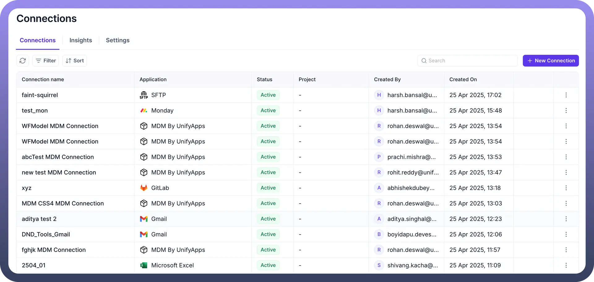

# What is Connection Manager?

Source: https://www.unifyapps.com/docs/platform-tools/what-is-connection-manager
Section: platform-tools

---

**Connection Manager** is a powerful feature within the UnifyApps Platform Tools that allows users to create, manage, and monitor connections to various third-party applications and services. Whether you're integrating communication tools like Microsoft Teams or Slack, CRM systems like NoCrm and Pipeline CRM, or internal systems like MDM (Master Data Management), Connection Manager makes it seamless and secure.

## Why Connection Manager?

In today’s integrated tech ecosystems, businesses rely on a variety of applications. Managing connections to each of these apps manually can be time-consuming, error-prone, and difficult to scale. UnifyApps' Connection Manager centralizes and simplifies this process by giving you a single interface to manage all your app connections.

## Key Features

1. **Centralized Connection Hub:** Easily view all your active connections in one place. The Connection Manager dashboard displays essential details like:
  - Connection Name
  - Application
  - Status
  - Project (if applicable)
  - Created By
  - Created On This provides full visibility and control over every integration in your workspace.
2. **Status Monitoring:** Each connection shows a status such as "Active", so you can instantly know which integrations are working as expected and which need attention.
3. **Activity Tracking:** Track who created each connection and when it was created. This helps in maintaining an audit trail and ensures better governance in team environments.
4. **Easy to Add New Connections**: With the **New Connection** button, users can quickly initiate new integrations with supported platforms. The process is streamlined to guide you through authentication and setup with minimal effort. Check this article know how to setup a new connection.
5. **Search, Filter & Sort:** To make managing large volumes of connections easier:
  - Use the **search** bar to find specific connections.
  - **Filter** by status, application type, or user.
  - **Sort** based on date, name, or other parameters.

## **Use Cases**

- **IT Teams** can monitor all third-party integrations across internal tools.
- **Product Managers** can track connection health for customer-facing features.
- **Data Analysts** can ensure consistent data flow from connected CRMs or communication tools.
- **Support Teams** can troubleshoot issues quickly by checking connection status and history.

## Example: How it looks in action

Here’s a sample view from the Connection Manager dashboard:

As seen above, you get a clear and organized table view with sortable columns. Each row represents a unique integration, complete with relevant metadata for easier management.
