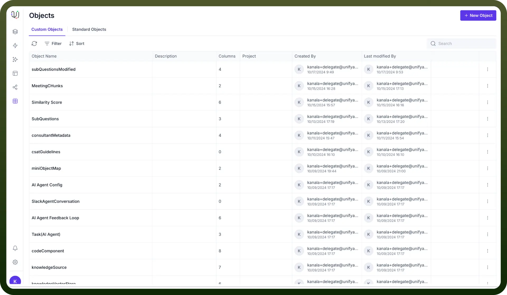
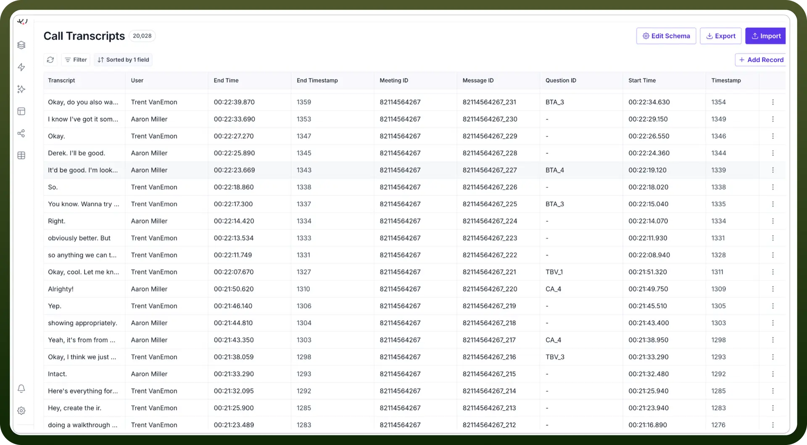
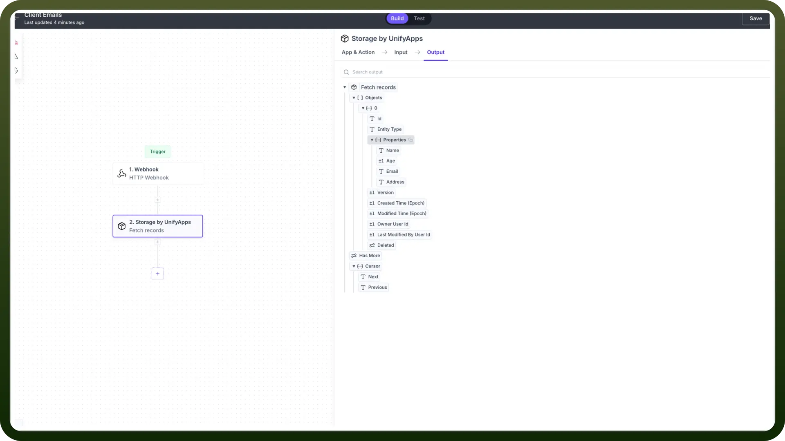
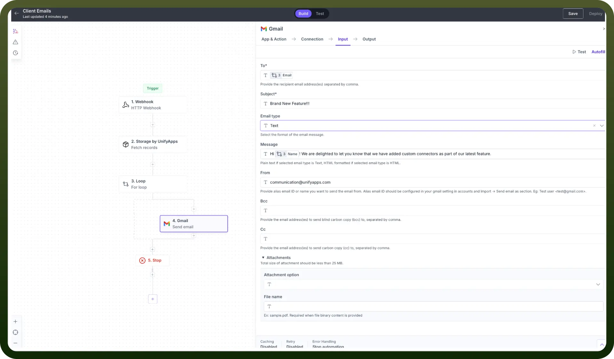
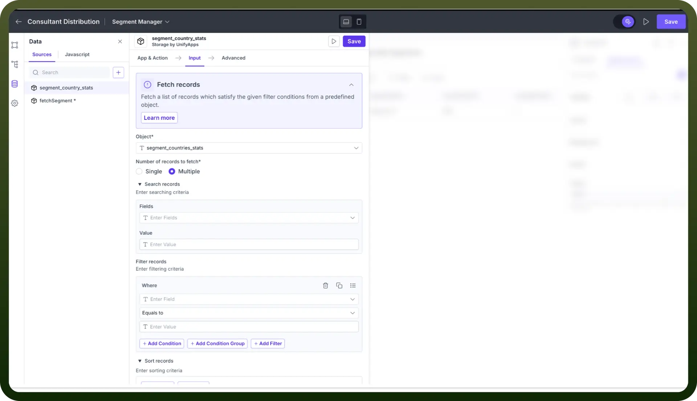
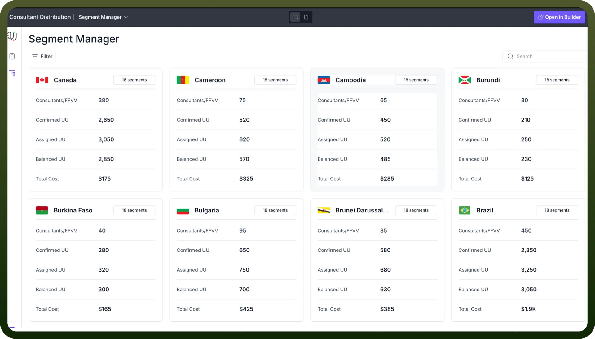

# What is Object Manager?

Source: https://www.unifyapps.com/docs/platform-tools/what-is-object-manager
Section: platform-tools

---

## Overview

**Objects** in UnifyApps are structured data entities that represent, store, and manipulate information across the platform. The **Object Manager** provides a centralized system to create, access, modify, and delete these objects.

## Why do we use an object?

Objects serve as transient links, bridging the gap between primary data sources and the downstream applications that consume this data. This enables you to preserve your data indefinitely, even if the data at the primary source has expired or been deleted.

### Use Case 1

- Let’s say we have to send feature announcement emails to all our clients to notify them about the latest platform updates.
- To achieve this, first, we should store all the client details, including their email addresses, in our object. We can then use it in our automation to send them individual emails.
- In your automation builder, add the **Storage by UnifyApps** node. Select the Fetch Records action to get all the details of your clients stored in your object.

  

- Next, add a Loop to iteratively send an email to each client. Construct your email desirably. After this is set up, you can save and deploy your automation, which will send your email to all your clients.

  

### Use Case 2

- Let’s say we have to display country-wise data in our application using simple cards.
- To achieve this, we will store all the relevant country details in an object, which we will access in our application.
- In your application builder, set up a data source which fetches records from your object using Storage by UnifyApps.

  

- Finally, match the respective fields in your components, and your application will display all the records dynamically from your object.

  
