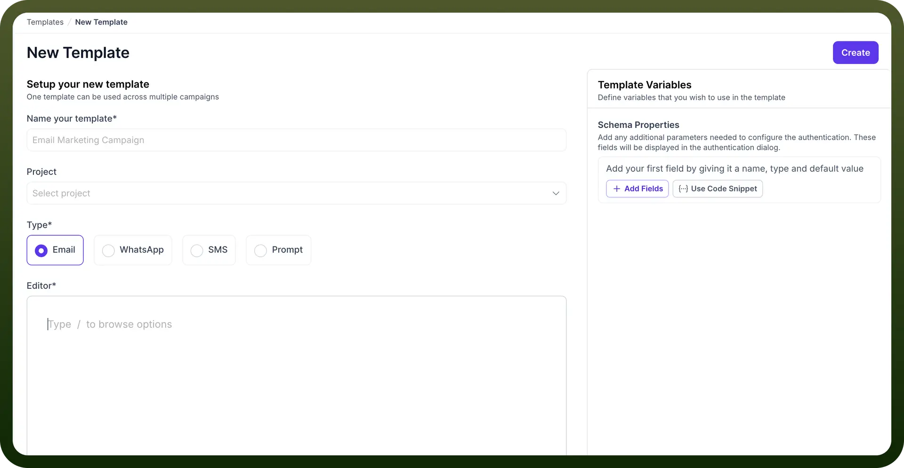

# What is Templates Manager?

Source: https://www.unifyapps.com/docs/platform-tools/what-is-templates-manager
Section: platform-tools

---

Templates are designed to maintain consistency and conformity with brand guidelines. These templates are created by admins and can be utilized for marketing campaigns, notifications, email templates, etc.

## Multi-Channel Template Support

Our Template Manager supports various communication channels to meet all your campaign needs:

1. Email: Create professional email templates for marketing campaigns
2. WhatsApp: Design message templates for WhatsApp Business communications
3. SMS: Develop text message templates for concise communications
4. Prompt: Set up prompt templates for interactive engagements

## Template Variables

Define custom variables that can be dynamically populated when using the template in campaigns. This feature allows personalization at scale, ensuring each recipient receives relevant content tailored specifically to them.

## How to Use Template Manager?

Creating a New Template:

1. Navigate to the Templates section and click "`New Template`"
2. Fill in the basic template information:
  - Name your template (e.g., "Email Marketing Campaign")
  - Select the associated project from the dropdown
  - Choose the template type (Email, WhatsApp, SMS, or Prompt)
3. Use the editor to design your template content
4. Add any necessary template variables and schema properties
5. Click "`Create`" to save your template

## Implementing Variables

The system supports dynamic content insertion through variables, allowing personalization at scale. Users can define custom variables that will be populated with recipient-specific information during campaign execution.

1. Define variables in the Template Variables section
2. Insert variables into your template content using the appropriate syntax
3. When the template is used in a campaign, these variables will be replaced with actual values

## Create an Email Template

1. **Template Naming:** Assign a unique identifier that will appear in the template library
2. **Communication Channel Selection**: Users can specify the delivery method (Email, WhatsApp, SMS, or Prompt)

